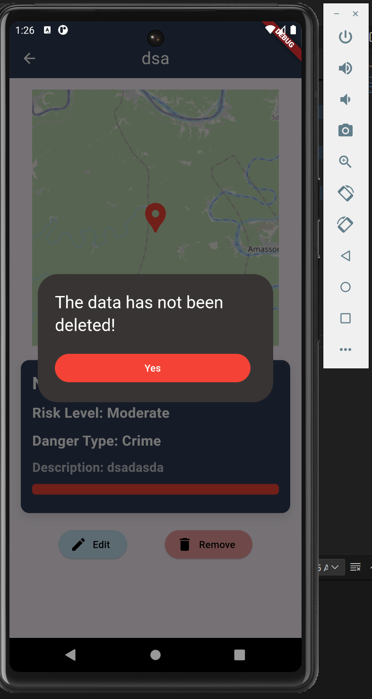

# group_project

ข้อมูลทั้งหมดอยู่ในไฟล์ db.json

npx json-server --watch db.json -h 10.200.21.199 -p 3000
Unable to add information ! \n Try again!
"Successful data insertion !"

<!-- localhost running -->
json-server --watch db.json --host localhost --port 3000 
ไม่สามารถใช้บน andrond simulitor ได้ เพราะไม่มีการเชื่อมต่อเครือข่ายส่วนตัวภายในเครื่อง

<!-- รูปภาพตอนออกแบบ -->
####################################################################################

ออกแบบ UI เป็นแนวทางในการเขียนโปรแกรม

<!-- --------------------------- -->

####################################################################################

<!-- รูปภาพหลังจากเสร็จสิ้น -->

####################################################################################

โปรแกรมที่ได้หลังจาก Coding

####################################################################################

<!-- --------------------------- -->
